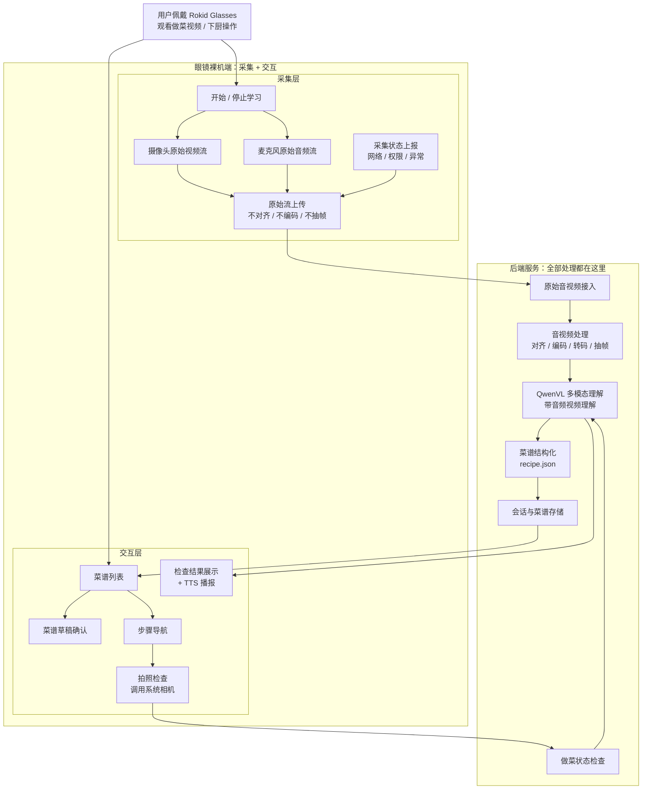
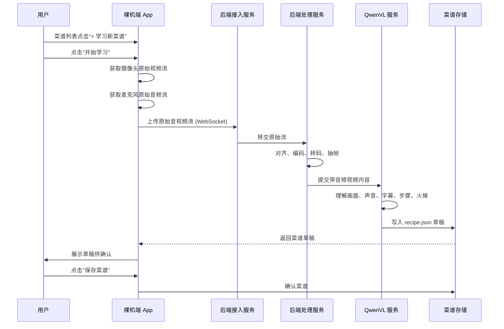
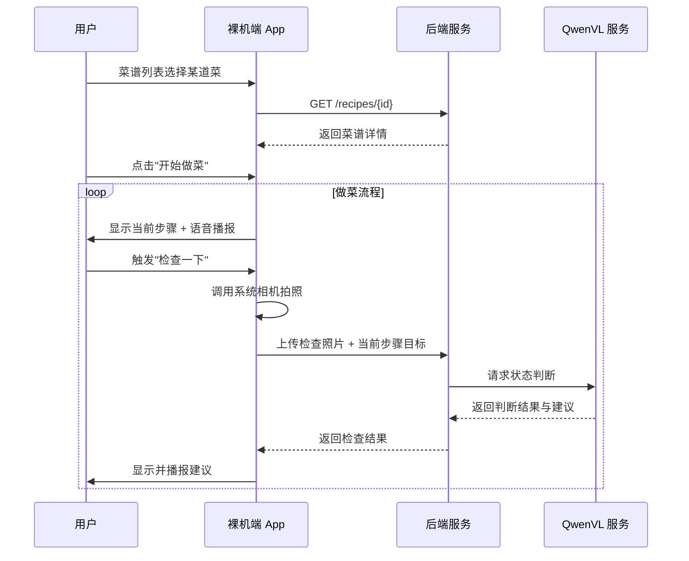
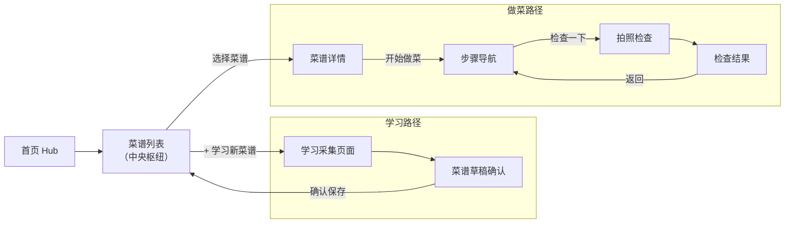
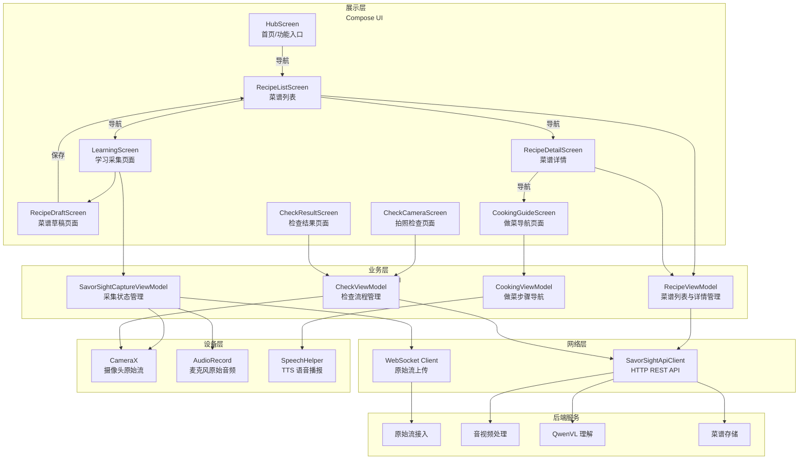
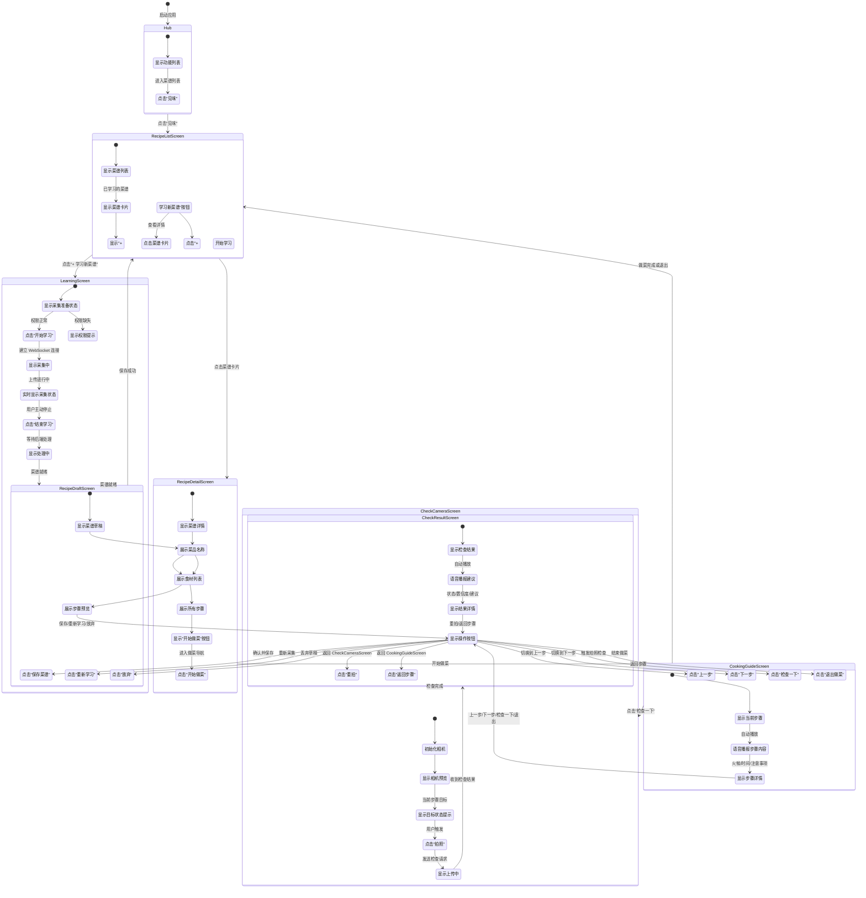
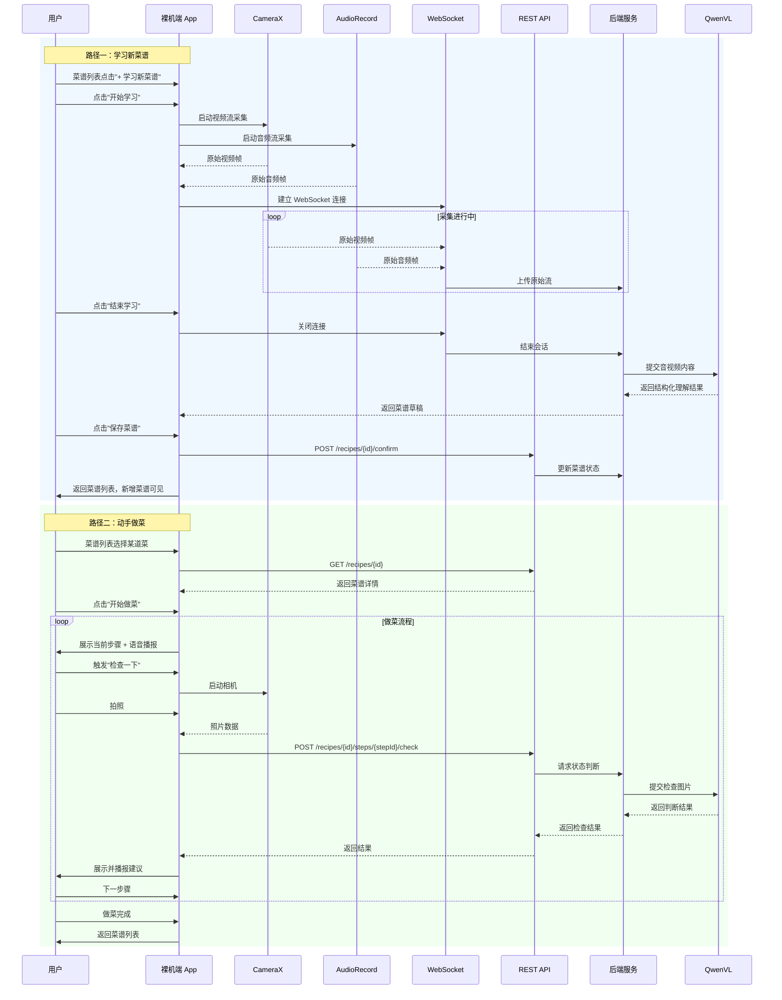

# 见味项目技术架构

## 1. 项目定位

见味是一个基于 Rokid Glasses 的 AI 做菜辅助应用，所有功能都在裸机 App 中完成。用户佩戴眼镜正常观看做菜视频，眼镜采集用户第一视角看到和听到的内容，后端将这些原始音视频数据理解为个人菜谱草稿；真正下厨时，裸机 App 在眼镜端提供菜谱列表、步骤导航、语音提示和拍照检查。

当前方案采用两段式架构：

```text
裸机端（采集 + 交互）
        ↕
后端 QwenVL 多模态理解
```

核心原则：

- 裸机端负责用户交互和原始音视频采集与上传。
- 后端负责所有音视频处理、理解、结构化和状态判断。
- 菜谱列表是中央枢纽，学习产出菜谱，做菜消费菜谱。

## 2. 最终架构结论

### 2.1 裸机端边界

裸机端承担用户交互 + 极薄采集两层职责。采集阶段保持极薄，不做任何会增加设备负载的处理；交互阶段负责所有用户界面和操作。

裸机端负责：

- **采集职责**（极薄层）：
  - 调用摄像头获取原始视频流。
  - 调用麦克风获取原始音频流。
  - 将原始流上传到后端。
  - 控制开始学习、停止学习、异常重连。
  - 上报权限、网络、采集状态。
- **交互职责**（用户界面）：
  - 菜谱列表展示与管理。
  - 菜谱详情展示。
  - 菜谱草稿确认。
  - 做菜步骤导航。
  - 拍照检查（调用系统相机）。
  - 检查结果展示与语音播报。
  - TTS 语音播报步骤和建议。

裸机端不负责：

- 不做音视频对齐。
- 不做编码或转码。
- 不做抽帧。
- 不做画面裁剪。
- 不做降噪。
- 不做 OCR。
- 不做 ASR。
- 不做食材、调料、步骤、火候识别。
- 不做菜谱结构化。
- 不跑 QwenVL 或任何重模型。

### 2.2 后端边界

后端是全部理解与处理中心。

后端负责：

- 接收眼镜上传的原始音视频流。
- 完成音视频对齐、编码、转码、切片、抽帧等处理。
- 调用 QwenVL 理解带音频的视频内容。
- 生成结构化菜谱 `recipe.json`。
- 管理学习会话、菜谱草稿和用户确认状态。
- 接收裸机 App 拍照检查图片。
- 根据当前步骤目标判断做菜状态。

后端不负责：

- 不抓取视频平台链接。
- 不绕过平台下载视频。
- 不替用户直接复制平台视频内容。

## 3. 总体架构图



## 4. 阶段一：观看学习

用户佩戴 Rokid Glasses 正常观看做菜视频。视频可以来自手机、电脑、平板或电视。眼镜端不需要接入视频平台，也不需要拿视频链接。

学习阶段的关键逻辑：

```text
用户正常观看视频
        ↓
裸机端采集原始视频流和音频流
        ↓
裸机端原样上传后端
        ↓
后端完成音视频处理
        ↓
QwenVL 理解带音频的视频内容
        ↓
生成菜谱草稿
        ↓
裸机端展示草稿供用户确认
        ↓
保存到菜谱列表
```

### 4.1 设备端数据

裸机端上传的数据应尽量接近原始采集结果。

数据类型：

- 摄像头视频流。
- 麦克风音频流。
- 采集开始与结束事件。
- 设备状态事件。

设备状态事件包括：

- 摄像头权限状态。
- 麦克风权限状态。
- 网络连接状态。
- 上传连接状态。
- 采集异常。

### 4.2 后端处理

后端收到原始流后，再做所有处理：

- 音视频同步。
- 编码、转码、切片。
- 抽帧。
- 画面裁剪。
- 画质增强。
- 噪声处理。
- 调用 QwenVL。
- 聚合时间线。
- 生成菜谱草稿。

架构层面不拆独立 ASR 模块。QwenVL 或后端多模态服务统一处理带音频的视频内容。如果内部实现需要转写音频，那属于模型服务内部细节，不单独暴露为项目模块。

## 5. 阶段二：做菜执行

用户确认菜谱后，系统进入做菜执行阶段。此阶段主要由 裸机 App 承担用户交互。

执行阶段流程：

```text
用户打开菜谱
        ↓
裸机 App 展示当前步骤
        ↓
裸机 App 播报当前步骤和注意事项
        ↓
用户切换步骤或请求检查
        ↓
裸机 App 拍照上传后端
        ↓
QwenVL 判断当前状态
        ↓
裸机 App 展示并播报建议
```

### 5.1 裸机 App 拍照检查

做菜阶段不需要裸机端参与拍照检查。裸机 App 可以通过相机能力完成单次拍照。

使用方向：

```js
const cameraContext = wx.createCameraContext()
```

拍照检查请求应包含：

- 检查图片。
- 当前菜谱 ID。
- 当前步骤 ID。
- 当前步骤目标状态。
- 用户问题，例如“现在是否可以进入下一步？”

### 5.2 检查结果

后端返回的检查结果应简短，适合眼镜端显示和播报。

结果类型建议：

- `pass`：可以进入下一步。
- `continue`：继续当前步骤。
- `adjust`：需要调整火候、时间或动作。
- `uncertain`：图片不清晰或无法判断。

## 6. 数据流时序

### 6.1 观看学习时序



### 6.2 做菜检查时序


## 7. 模块设计

### 7.1 裸机端 App

模块名：`SavorSightApp`（即见味裸机 App）

职责：

- **采集层**：
  - 管理学习采集生命周期。
  - 获取摄像头原始视频流。
  - 获取麦克风原始音频流。
  - 建立上传连接。
  - 发送原始流到后端。
  - 上报设备状态。
- **交互层**：
  - 菜谱列表展示与管理。
  - 菜谱详情展示。
  - 菜谱草稿确认。
  - 做菜步骤导航。
  - 拍照检查（调用系统相机）。
  - 检查结果展示与 TTS 播报。

内部模块：

```text
SavorSightApp
├── savorsight/                      # 见味核心业务(SavorSight)
│   ├── SavorSightApiClient.kt       # REST API 客户端
│   ├── SavorSightCaptureViewModel   # 采集状态管理
│   ├── SavorSightCaptureState.kt    # 采集状态定义
│   ├── SavorSightRawStreamUploader.kt # WebSocket 原始流上传
│   ├── RecipeViewModel.kt        # 菜谱列表与详情管理
│   ├── CookingViewModel.kt       # 做菜步骤导航（待拆分）
│   ├── CheckViewModel.kt         # 检查流程管理
│   ├── SpeechHelper.kt           # TTS 语音播报
│   └── ui/                       # 各页面 Composable
├── camera/                       # 摄像头绑定
├── input/                        # 眼镜按键输入处理
├── navigation/                   # 路由导航
├── sensor/                       # IMU 传感器
└── ui/                           # UI 组件与主题
```

采集层需要特别避免：

- 不在摄像头模块里抽帧。
- 不在音频模块里做降噪或转写。
- 不在上传模块里做编码、转码或内容理解。

### 7.2 后端服务

模块名建议：`SavorSightAIService`

职责：

- 接收原始音视频流。
- 保存学习会话。
- 后端处理音视频。
- 调用 QwenVL。
- 生成菜谱草稿。
- 处理做菜检查图片。

内部模块：

```text
SavorSightAIService
├── StreamIngestService
├── MediaProcessingService
├── QwenVLInferenceService
├── RecipeStructuringService
├── CookingCheckService
├── SessionService
└── StorageService
```
## 8. 接口草案

### 8.1 创建学习会话

```http
POST /api/learning-sessions
```

请求：

```json
{
  "deviceId": "rokid-glasses-001",
  "sourceMode": "glasses_first_person_stream",
  "capturePolicy": "raw_stream_upload_only"
}
```

返回：

```json
{
  "sessionId": "learn-2026-001",
  "uploadEndpoint": "wss://api.example.com/api/learning-sessions/learn-2026-001/raw-stream",
  "status": "created"
}
```

### 8.2 原始流上传

```http
WebSocket /api/learning-sessions/{sessionId}/raw-stream
```

消息类型：

```json
{
  "type": "raw_video",
  "payload": "binary"
}
```

```json
{
  "type": "raw_audio",
  "payload": "binary"
}
```

```json
{
  "type": "device_status",
  "payload": {
    "camera": "active",
    "microphone": "active",
    "network": "connected"
  }
}
```

### 8.3 结束学习会话

```http
POST /api/learning-sessions/{sessionId}/finish
```

返回：

```json
{
  "sessionId": "learn-2026-001",
  "status": "processing",
  "estimatedSeconds": 30
}
```

### 8.4 获取菜谱草稿

```http
GET /api/learning-sessions/{sessionId}/recipe-draft
```

返回：

```json
{
  "recipeId": "recipe-001",
  "dishName": "番茄炒蛋",
  "confidence": 0.86,
  "ingredients": [
    {
      "name": "番茄",
      "amount": "2 个",
      "prep": "切块"
    },
    {
      "name": "鸡蛋",
      "amount": "3 个",
      "prep": "打散"
    }
  ],
  "steps": [
    {
      "id": "step-01",
      "title": "炒鸡蛋",
      "instruction": "鸡蛋液下锅，炒到半凝固后盛出。",
      "heat": "中火",
      "targetState": "鸡蛋半凝固，表面仍略湿润",
      "checkable": true,
      "confidence": 0.84
    }
  ],
  "uncertainFields": [
    {
      "field": "生抽用量",
      "question": "视频中用量不清楚，是否按 1 勺保存？"
    }
  ]
}
```

### 8.5 确认菜谱

```http
POST /api/recipes/{recipeId}/confirm
```

请求：

```json
{
  "confirmedByUser": true,
  "patch": {
    "servings": 2
  }
}
```

### 8.6 做菜拍照检查

```http
POST /api/recipes/{recipeId}/steps/{stepId}/check
```

请求：

```json
{
  "image": "uploaded-image-object",
  "targetState": "鸡蛋半凝固，表面仍略湿润",
  "question": "当前状态是否可以进入下一步？"
}
```

返回：

```json
{
  "status": "continue",
  "confidence": 0.82,
  "summary": "鸡蛋还偏湿，边缘已经开始凝固。",
  "suggestion": "继续中火翻炒约 20 秒，再盛出。",
  "tts": "还差一点，继续中火翻炒二十秒。"
}
```

## 9. MVP 范围

### 9.1 第一版必须打通

- 裸机 App 菜谱列表展示。
- 裸机 App 学习采集功能。
- 裸机端创建学习会话。
- 裸机端采集原始音视频流。
- 裸机端上传原始流到后端。
- 后端接收原始流。
- 后端处理原始流。
- 后端调用 QwenVL 生成菜谱草稿。
- 裸机 App 展示菜谱草稿。
- 裸机 App 菜谱详情展示。
- 裸机 App 展示做菜步骤。
- 裸机 App 调用相机完成拍照检查。
- 后端返回检查结果。
- 裸机 App 展示并播报检查建议。

### 9.2 第一版暂不做

- 不做视频链接解析。
- 不做云端抓取平台视频。
- 不做裸机端音视频对齐。
- 不做裸机端编码或转码。
- 不做裸机端抽帧。
- 不做裸机端 OCR、ASR 或模型推理。
- 不做菜谱社区。
- 不做购物清单自动下单。
- 不做复杂用户系统。

## 10. 合规与产品边界

见味不通过视频链接抓取平台内容。系统只处理用户佩戴眼镜时第一视角看到和听到的内容，用于生成用户自己的学习笔记和做菜辅助流程。

边界说明：

- 用户必须主动开启学习模式。
- 设备应明确提示正在采集音视频。
- 后端不保存完整原视频作为内容分发素材。
- 生成结果定位为个人菜谱草稿。
- 用户确认后才进入做菜导航。

## 11. 风险点

### 11.1 原始流上传压力

裸机端上传原始流会依赖网络质量。MVP 阶段可以通过控制学习时长和后端接入能力来降低风险，但不要把压缩、转码、抽帧等处理放回设备端。

### 11.2 第一视角拍屏质量

用户观看手机或电脑屏幕时，眼镜采集到的是拍屏画面，可能存在反光、摩尔纹、偏角和遮挡。后端需要做画面处理和容错。

### 11.3 厨房检查准确性

锅内状态受光线、油烟、遮挡影响。第一版应选择容易判断的检查点，例如"是否切好""是否变色""是否收汁明显"，不要承诺精细熟度判断。

### 11.4 模型输出稳定性

QwenVL 需要被约束输出固定 JSON Schema。后端应做 JSON 校验、字段补全和置信度标记。

## 12. 当前技术依据

- Rokid Glasses 裸机开发支持本机 Android 应用开发，并提供拍照/录像、原始音频、按键与传感器等设备能力。
- Android CameraX / AudioRecord 可用于学习阶段的原始音视频流采集。
- Android 系统相机可用于做菜阶段的单次拍照检查。
- Android TTS 可用于步骤和检查结果的语音播报。
- Qwen2.5-VL 具备视频理解、事件定位和结构化输出能力，适合作为后端多模态理解核心。

参考链接：

- Rokid Glasses 裸机开发简介：<https://custom.rokid.com/prod/rokid_web/ff28c865a9634876be98cbc293588460/pc/cn/index.html?documentId=201f7e36b17b4a4389ea4c38a4f23381>
- Qwen2.5-VL 官方博客：<https://qwenlm.github.io/blog/qwen2.5-vl/>

## 13. 最终方案表述

见味采用"裸机端全功能、后端多模态理解"的架构。观看学习阶段，Rokid Glasses 裸机端调用摄像头和麦克风采集原始音视频流，把原始数据上传到后端；所有对齐、编码、转码、抽帧、理解和菜谱结构化都在后端完成，由 QwenVL 统一理解带音频的视频内容。做菜执行阶段，裸机端展示步骤导航，用户可触发"检查一下"拍照上传后端，由 QwenVL 判断当前状态并返回建议。

## 14. 见味裸机 App 产品设计

### 14.1 产品定位

见味是一款运行在 Rokid Glasses 上的 AI 做菜辅助应用，所有功能都在裸机 App 中完成，基于 Android 原生开发。

**两大核心场景并行独立：**

| 场景 | 描述 | 入口 |
|------|------|------|
| 学习新菜谱 | 佩戴眼镜观看做菜视频，AI 自动生成结构化菜谱 | 菜谱列表页 → "+ 学习新菜谱" |
| 动手做菜 | 从菜谱列表选择一道菜，按步骤导航做菜，支持拍照检查 | 菜谱列表页 → 选择菜谱 → "开始做菜" |

**核心理念：学习和做菜是两条独立路径，菜谱列表是中央枢纽。**



### 14.2 用户流程图

```mermaid
flowchart TB
    subgraph Start[启动]
        S1[打开见味 App]
    end

    subgraph HubPage[首页 Hub]
        H1[显示功能入口]
    end

    subgraph RecipeListPage[菜谱列表页]
        R1[显示已学习的菜谱]
        R2{选择操作?}
        R3[点击 + 学习新菜谱]
        R4[点击某道菜谱]
    end

    subgraph Learning[学习新菜谱]
        L1[佩戴眼镜<br/>观看做菜视频]
        L2[点击"开始学习"]
        L3[眼镜采集<br/>第一视角音视频流]
        L4[原始流上传后端]
        L5[后端处理 + QwenVL 理解]
        L6[生成菜谱草稿]
        L7[查看并确认草稿]
        L8[保存到菜谱列表]
    end

    subgraph Cooking[动手做菜]
        C1[查看菜谱详情]
        C2[点击"开始做菜"]
        C3[显示当前步骤]
        C4[语音播报步骤]
        C5{遇到疑问?}
        C6[触发"检查一下"]
        C7[拍照上传后端]
        C8[查看检查建议]
        C9[下一步骤]
        C10[做菜完成]
    end

    S1 --> H1
    H1 -->|进入见味| R1
    R1 --> R2
    R2 -->|学习新菜| R3
    R2 -->|选择菜谱| R4

    R3 --> L1
    L1 --> L2 --> L3 --> L4 --> L5 --> L6
    L6 --> L7 --> L8 --> R1

    R4 --> C1 --> C2 --> C3 --> C4 --> C5
    C5 -->|否| C9
    C5 -->|是| C6 --> C7 --> C8 --> C9
    C9 -->|未完成| C3
    C9 -->|完成| C10 --> R1
```

**核心用户路径：**

1. **路径一：学习新菜谱**
   - 打开 App → 菜谱列表 → 点击"+ 学习新菜谱"
   - 佩戴眼镜正常观看做菜视频（手机/电脑/平板/电视均可）
   - 点击"开始学习"，眼镜采集第一视角原始音视频流上传后端
   - 后端处理 + QwenVL 理解 → 生成菜谱草稿
   - 用户确认草稿 → 保存到菜谱列表

2. **路径二：动手做菜**
   - 打开 App → 菜谱列表 → 选择要做的菜
   - 查看菜谱详情 → 点击"开始做菜"
   - 按步骤导航做菜，语音自动播报
   - 遇到不确定的情况 → 触发"检查一下" → 拍照 → 查看 AI 建议
   - 完成所有步骤 → 做菜完成

### 14.3 应用架构图



**架构原则：**

- **单端全功能**：所有用户交互都在裸机 App 中完成，基于 Android 原生开发，不依赖 AIUI。
- **极薄采集层**：采集阶段不做编码、转码、抽帧、内容理解，只负责原始数据采集和上传。
- **菜谱列表为枢纽**：学习产出菜谱，做菜消费菜谱，两者通过菜谱列表连接。
- **状态驱动 UI**：所有业务状态集中在 ViewModel，UI 只负责展示和交互。
- **网络解耦**：API 调用和网络连接封装在独立模块，便于切换 Mock/真实后端。
- **设备能力抽象**：摄像头、麦克风、TTS 等设备能力封装为独立 Helper，不与业务逻辑耦合。

### 14.4 UI 页面导航与交互逻辑



**页面交互规范：**

| 页面 | 主要交互 | 返回行为 |
|------|----------|----------|
| Hub | 选择功能入口 | - |
| RecipeListScreen | 浏览菜谱、选择菜谱、学习新菜谱 | 返回 Hub |
| RecipeDetailScreen | 查看菜谱详情、开始做菜 | 返回 RecipeListScreen |
| LearningScreen | 开始/结束学习 | 返回 RecipeListScreen |
| RecipeDraftScreen | 保存/重新学习/放弃 | 返回 RecipeListScreen 或 LearningScreen |
| CookingGuideScreen | 步骤导航、检查一下、退出 | 返回 RecipeListScreen 或进入 CheckCamera |
| CheckCameraScreen | 拍照 | 返回 CookingGuideScreen |
| CheckResultScreen | 重拍/返回 | 返回 CheckCameraScreen 或 CookingGuideScreen |

**D-pad 按键映射（眼镜端）：**

| 按键 | 列表页 | 详情页 | 采集中 | 做菜导航中 | 检查中 |
|------|--------|--------|--------|------------|--------|
| ↑/↓ | 上下移动焦点 | 上下滚动内容 | 切换上下选项 | 上下一步 | - |
| 确认键 | 进入选中项 | 开始做菜 | 开始/结束学习 | 确认操作 | 拍照 |
| 返回键 | 返回上一页 | 返回列表 | 停止采集并返回 | 退出做菜流程 | 返回上一步 |
| 长按确认 | - | - | - | 触发检查一下 | - |

### 14.5 核心数据流



### 14.6 应用信息

| 属性 | 值 |
|------|-----|
| 产品名称 | 见味 |
| Android 应用名称 | 见味 |
| 包名 | com.savorsight |
| 项目目录 | SavorSightApp |
| 模块名 | SavorSightApp |
| 主题 | Theme.SavorSight |

**源码结构：**

```
SavorSightApp/
└── SavorSightApp/
    └── src/main/java/com/savorsight/
        ├── activities/main/
        │   ├── MainActivity.kt        # 应用入口，导航 host
        │   └── HubScreen.kt          # 首页，功能入口
        ├── savorsight/                  # 见味核心业务(SavorSight)模块
        │   ├── SavorSightApiClient.kt   # API 客户端
        │   ├── SavorSightCaptureViewModel.kt  # 采集状态管理
        │   ├── SavorSightCaptureState.kt     # 采集状态定义
        │   ├── SavorSightRawStreamUploader.kt # WebSocket 上传
        │   ├── LearningScreen.kt       # 学习采集页面
        │   ├── RecipeViewModel.kt      # 菜谱列表与详情管理
        │   ├── RecipeListScreen.kt     # 菜谱列表页面
        │   ├── RecipeDetailScreen.kt   # 菜谱详情页面
        │   ├── RecipeDraftScreen.kt     # 菜谱草稿页面
        │   ├── CookingGuideScreen.kt    # 做菜导航页面
        │   ├── CheckViewModel.kt       # 检查流程管理
        │   ├── CheckCameraScreen.kt    # 拍照检查页面
        │   ├── CheckResultScreen.kt    # 检查结果页面
        │   └── SpeechHelper.kt         # TTS 语音播报
        ├── navigation/
        │   └── BareSceneRoutes.kt    # 路由常量定义
        ├── input/                    # 眼镜按键输入处理
        ├── camera/                   # 摄像头绑定
        ├── sensor/                   # IMU 传感器
        └── ui/                       # UI 组件与主题
```
